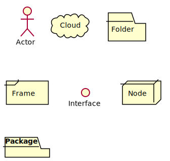

# DAM Ecosystem Mapping

This repository is part of the Digital Asset Management Ecosystem Assessment project at the Hesburgh Libraries.

One component of the project is to gather a draft of the systems that currently contribute to the ecosystem. See the [project charter](https://docs.google.com/document/d/1Pw-cuIuwyovFWQ23uH896Hr0iefDRb7YE78aUl4h_wU/edit?usp=drive_web&ouid=103549390016362126215) for greater context.

## Diagrams

The diagrams are written using [PlantUML](http://plantuml.com) and generated via [Atom](https://atom.io)'s [plantuml-preview](https://github.com/peele/plantuml-preview) plugin.

Status | Application | Diagram
-|-|-
? | Aleph   |
First Pass | [ArchivesSpace](http://archivesspace.library.nd.edu) | [Diagram](./plantuml/archivesspace.svg)
? | Coral   |
First Pass | [CurateND](https://curate.nd.edu) | [Diagram](./plantuml/curate_nd.svg)
? | DEC   |
? | Google Team Drives   |
? | Inquisitions   |
? | Intranet   |
? | Loading Dock   |
Pending | [MARBLE](https://marble.library.nd.edu) | -
? | Medieval Microfilms |
? | Numismatics   |
? | Primo   |
? | Remix   |
? | Reserves |
Pending | [Seaside](https://seaside.library.nd.edu) | -
First Pass | [Sipity](https://deposit.library.nd.edu) | [Diagram](./plantuml/sipity.svg)
First Pass | VRC   | [Diagram](./plantuml/vrc.svg)
? | Website   |
? | ?   |   |

### States

* Pending - Waiting on a conversation to better understand
* First Pass - Written as a matter of starting a conversation.

### Directonal Arrows

* Bi-directional - Both elements know that each other exist
* Uni-directional - The pointing element knows of the existence of the target of the arrow, the targeted element does not know that the pointing element

In some cases you'll see a line like this `--(O)--` or a line like `--(` connecting two systems. These connections highlight an interface common relationship. An example is a URL in ArchivesSpace that is the digital object with a home in rarebooks.library.nd.edu. ArchivesSpace technically doesn't "know" about rarebooks.library.nd.edu, but the data does.

### Shapes

[PlantUML](http://plantuml.com) provides a set of images to use for diagramming.

* **Actor** - a person
* **Cloud** - indicates a cloud-provided service, either admnistered by Notre Dame or otherwise
  - Examples include: Google Drive, AWS, Orcid, OSF
* **Folder** - a conceptual storage partition
  - Examples include: a specific Shared Drive in Google Drive
* **Frame** - presently unused
* **Interface** - represents a conceptual interface for other services to conntect
  - Examples include: Bendo's HTTP interface
* **Node** - an application or service run locally on a machine.
  - Examples include: BitCurator, Adobe Acrobat, ImageMagick
* **Package** - an application or service locally maintained, but URL addressable.
  - Examples include: curate.nd.edu, deposit.library.nd.edu

### Concering Applications

This documentation does not look to articulate what "goes in" an application. Instead to define the technology (in particular storage) and interactions between systems.

The goal of the documentation is not to identify data flow but instead where data (either metadata or digital objects) may exist
